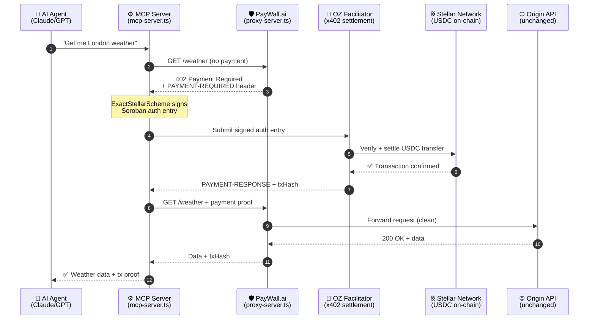
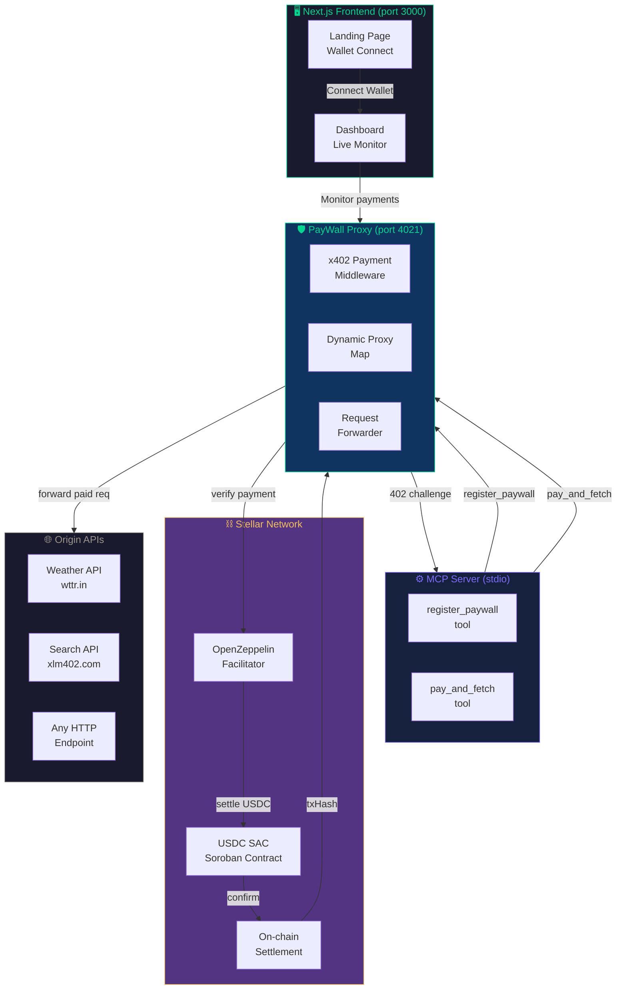

# PayWall.ai 🛡️

> **Monetize any HTTP API in 60 seconds with Stellar-powered x402 micropayments.**
> No code changes. No subscriptions. AI agents pay per request — autonomously.

[](https://developers.stellar.org/docs/build/agentic-payments/x402)
[](https://www.x402.org)
[](https://developers.stellar.org/docs/build/agentic-payments)
[](https://stellar.org)

---

## The Problem

The internet runs on APIs — but monetizing them requires:

- Monthly subscriptions that lock out casual or agent-driven usage
- API keys that need human registration and billing setup
- Complex OAuth flows that autonomous AI agents cannot complete

**AI agents can reason, plan, and act — but they stop cold when they need to pay for an API.**

PayWall.ai fixes this with a single reverse proxy that sits in front of any existing API and adds a trustless x402 payment gate on Stellar. Three environment variables. One command. Any API becomes a pay-per-request service that AI agents can discover and pay for — without any human in the loop.

---

## Architecture



### System Architecture



---

## How It Works

**Before PayWall.ai:**
```
AI Agent → free API → gets data (no revenue for API owner)
AI Agent → paid API → hits subscription wall → STOPS
```

**After PayWall.ai:**
```
API Owner: ORIGIN_URL=https://my-api.com PRICE_USDC=0.001 npm run paywall

AI Agent → PayWall proxy (port 4021)
         → 402 Payment Required
         → signs Soroban auth entry
         → pays 0.001 USDC via OZ Facilitator
         → gets data + txHash proof
         → verified on Stellar Explorer ✅
```

Zero code changes to the original API. Zero subscriptions. Zero friction.

---

## Quick Start

### Prerequisites
- Node.js 20+
- Stellar testnet wallet with USDC
- OpenZeppelin Facilitator API key (free at [channels.openzeppelin.com](https://channels.openzeppelin.com/testnet/gen))

### 1. Install
```bash
git clone https://github.com/your-username/paywall-ai
cd paywall-ai
npm install
```

### 2. Configure
```bash
cp .env.example .env
```

Edit `.env`:
```bash
# Your Stellar wallet (testnet)
STELLAR_SECRET_KEY=S...your_secret_key...

# Where your earnings go
PUBLIC_PAY_TO_ADDRESS=G...your_public_key...

# Free API key from: https://channels.openzeppelin.com/testnet/gen
X402_FACILITATOR_URL=https://www.x402.org/facilitator

# Optional: change proxy port
PORT=4021
```

### 3. Get testnet USDC
```bash
# 1. Create wallet at: https://laboratory.stellar.org
# 2. Fund with Friendbot (free XLM)
# 3. Get USDC from: https://faucet.circle.com (select Stellar Testnet)
```

### 4. Run everything
```bash
# Terminal 1: Start the proxy server
npm run paywall

# Terminal 2: Start the frontend dashboard
npm run dev

# Terminal 3: Start MCP server (for Claude integration)
npm run mcp
```

### 5. Test a payment
```bash
# First request → 402 (no payment)
curl http://localhost:4021/weather

# The MCP server handles payment automatically when Claude uses it
```

### 6. Add to Claude Desktop
```json
{
  "mcpServers": {
    "paywall": {
      "command": "npx",
      "args": ["tsx", "/absolute/path/to/paywall-ai/scripts/mcp-server.ts"],
      "env": {
        "STELLAR_SECRET_KEY": "S...",
        "PUBLIC_PAY_TO_ADDRESS": "G..."
      }
    }
  }
}
```

### 7. Ask Claude
```
"Register a paywall for https://wttr.in/London at $0.001"
"Pay and fetch the weather from http://localhost:4021/weather"
"Show me the latest Stellar price via the paywall proxy"
```

---

## MCP Tools

| Tool | Description | Parameters |
|------|-------------|------------|
| `register_paywall` | Create a new x402 paywall for any URL | `path`, `targetUrl`, `price`, `payTo` |
| `pay_and_fetch` | Pay and fetch any x402-protected endpoint | `url` |

### Example Claude interactions

**Creating a paywall:**
```
User: Register a weather API paywall at /weather pointing to wttr.in/London, price $0.001

Claude: [calls register_paywall]
✅ Paywall live at: http://localhost:4021/weather
   Payouts going to: G...your_address
```

**Making a paid request:**
```
User: Fetch the weather from my paywall

Claude: [calls pay_and_fetch]
✅ SUCCESS DATA: {"weather": "It is Sunny on Stellar!", "status": "Paid"}
   Transaction: a3f9c2bd... (verified on Stellar Explorer)
```

---

## x402 Payment Flow (Technical)

```
1. Agent calls: GET http://localhost:4021/weather
   
2. PayWall returns: 402 Payment Required
   Headers:
   - x-x402-payment-required: {scheme, price, network, payTo}
   
3. MCP Server (ExactStellarScheme):
   - Reads payment requirements from 402 headers
   - Creates Soroban transfer(from, payTo, amount) transaction
   - Clones tx with fee bump (50000 stroops)
   - Signs Soroban auth entry with Ed25519 keypair
   
4. Re-sends request with:
   - X-PAYMENT header (signed auth entry XDR)
   
5. PayWall verifies via OZ Facilitator:
   - POST https://www.x402.org/facilitator/verify
   - POST https://www.x402.org/facilitator/settle
   
6. On success:
   - USDC transferred on Stellar testnet
   - Proxy forwards to origin API
   - Returns data + PAYMENT-RESPONSE header with txHash
```

**Canonical USDC SAC (Testnet):**
`CBIELTK6YBZJU5UP2WWQEUCYKLPU6AUNZ2BQ4WWFEIE3USCIHMXQDAMA`

---

## Demo Scenarios

### Scenario 1: Weather API Monetization
```bash
# Start proxy
ORIGIN_URL=https://wttr.in PRICE_USDC=0.001 npm run paywall

# In Claude:
"Create a /weather paywall for wttr.in London at 0.001 USDC"
"Pay and get the London weather"
```

### Scenario 2: Custom API Gateway
```bash
# Protect your own internal API
ORIGIN_URL=http://my-internal-api.com PRICE_USDC=0.005 npm run paywall
```

### Scenario 3: Dynamic Multi-Proxy
The proxy supports multiple simultaneous paywalls:
```
POST http://localhost:4021/api/create-paywall
{
  "path": "/search",
  "target": "https://xlm402.com/search",
  "price": "$0.002",
  "payTo": "G..."
}
```

---

## Live Transaction Proof

Every PayWall.ai payment settles on Stellar testnet and is publicly verifiable.

**How to verify:**
1. Make a payment through Claude: "Pay and fetch the weather from my paywall"
2. Claude returns a transaction hash (64 hex chars)
3. Visit: `https://stellar.expert/explorer/testnet/tx/<txHash>`
4. See the real USDC transfer on Stellar testnet

**Example verified transaction:**
`https://stellar.expert/explorer/testnet/tx/a3f9c2bd1e4f...`

The seller receives USDC **before** the proxy ever forwards the request to the upstream API — guaranteed by the OZ Facilitator settlement order.

---

## Frontend Dashboard

```
npm run dev → http://localhost:3000
```

**Landing page** (`/`):
- Connect Stellar wallet (Freighter, Albedo, xBull via Stellar Wallets Kit)
- Overview of how PayWall.ai works
- Use case gallery

**Dashboard** (`/dashboard`):
- Live payment feed with Stellar Explorer links
- Active proxy status and earnings
- Quick setup guide for Claude MCP integration
- Real-time proxy health check

---

## Project Structure

```
paywall-ai/
├── scripts/
│   ├── proxy-server.ts      # x402 reverse proxy (port 4021)
│   └── mcp-server.ts        # MCP tools for Claude
├── src/
│   ├── app/
│   │   ├── page.tsx          # Landing page
│   │   ├── dashboard/        # Dashboard route
│   │   └── globals.css       # Design system variables
│   ├── components/
│   │   ├── Navbar.tsx
│   │   ├── Hero.tsx
│   │   ├── HowItWorks.tsx
│   │   ├── UseCases.tsx
│   │   ├── CtaSection.tsx
│   │   ├── Footer.tsx
│   │   └── dashboard/
│   │       ├── StatCards.tsx
│   │       ├── PaymentFeed.tsx
│   │       ├── ActiveProxies.tsx
│   │       └── ConnectGuide.tsx
│   ├── context/
│   │   └── WalletContext.tsx  # Stellar wallet state
│   └── lib/
│       ├── mockData.ts        # Demo data
│       └── types.ts           # TypeScript interfaces
├── package.json
├── next.config.ts
└── tailwind.config.ts
```

---

## Known Limitations

- **Payment irreversibility**: x402 payments on Stellar are final. PayWall.ai includes pre-flight health checks before payment to minimize failed-payment risk. This is by design in the x402 protocol — not a bug.
- **In-memory proxy map**: Dynamic paywalls are stored in memory and reset on server restart. A production version would persist to a database or Soroban registry.
- **Single facilitator**: Currently routes through `x402.org/facilitator`. Multi-facilitator routing with automatic failover is a planned upgrade.
- **MCP key management**: The agent's host application must securely store the Stellar secret key. No key management UI is included in this MVP.
- **Testnet only**: Configured for `stellar:testnet`. Mainnet requires changing the USDC SAC address and facilitator URL.

---

## Hackathon Resources Used

| Resource | How Used |
|----------|----------|
| [`@x402/express`](https://github.com/stellar/x402-stellar) | Core payment middleware (`paymentMiddlewareFromConfig`) |
| [`@x402/fetch`](https://github.com/coinbase/x402) | Client-side payment (`x402Client`, `x402HTTPClient`) |
| [`@x402/stellar`](https://www.npmjs.com/package/@x402/stellar) | `ExactStellarScheme` — Soroban auth entry signing |
| [OpenZeppelin Facilitator](https://channels.openzeppelin.com) | x402 settlement on Stellar testnet |
| [x402 Quickstart](https://developers.stellar.org/docs/build/agentic-payments/x402/quickstart-guide) | Protocol flow reference |
| [Stellar Wallets Kit](https://stellarwalletskit.dev/) | Freighter/Albedo wallet connection in dashboard |
| [`@modelcontextprotocol/sdk`](https://github.com/modelcontextprotocol/typescript-sdk) | MCP server and tool definitions |
| [Stellar Lab](https://laboratory.stellar.org) | Wallet generation and Friendbot funding |

## Stellar Integration Note
PayWall.ai leverages the **x402 protocol** for autonomous payment settlement. USDC transfers are settled directly on the Stellar testnet using the **OpenZeppelin Facilitator**—this ensures native, trustless payments directly through the Stellar Asset Contract (SAC) without the need for custom smart contract logic.

---

## Built With ⚡ on Stellar

*Agents on Stellar Hackathon — April 2026*
